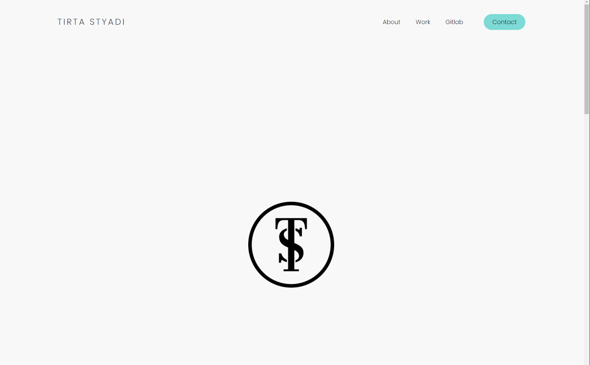
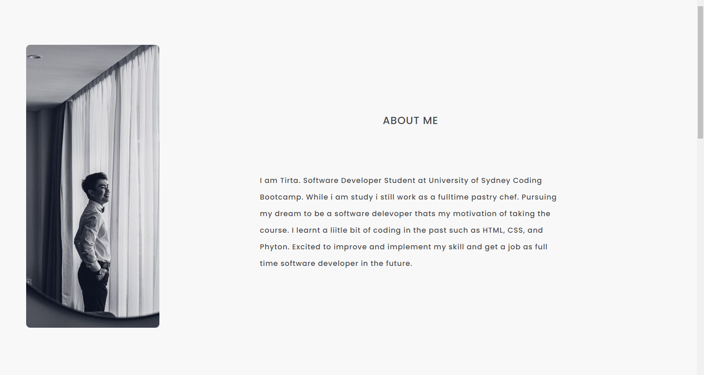
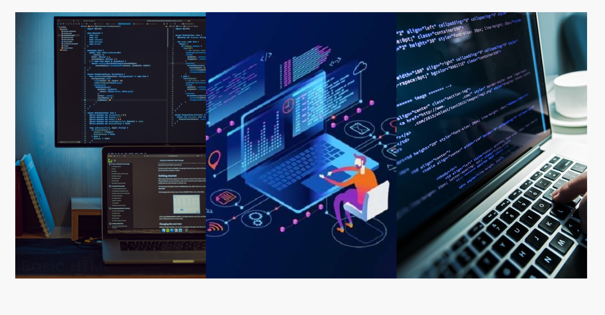
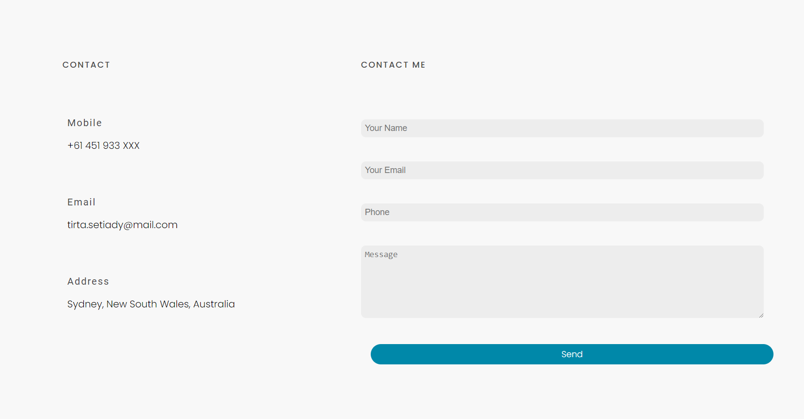
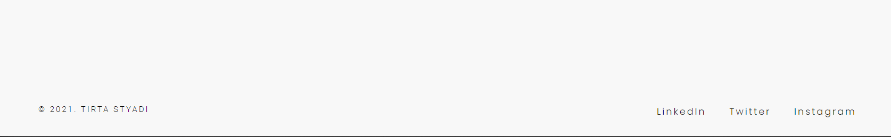

# Building Responsive Portfolio Website

---

## Motivation

Motivation behind this project is to build a responsive webpage which applicable to any screen. Also on the other hand this project was dedicated to implement what i have learnt about HTML and CSS. Simplicity and Clean design is the one i choosed to maximized the user experience.

---
## Installation

The Installation of this webpage will be straight forward simply click the links below or 
copy the links to the browser you are going to use, to achieve the best experience of 
this website make sure you are using desktop.

Github link is provided to further check and test.

* Webpage Link
https://tirtasty.github.io/tirtastyadi-portfolio/

* Github Link
https://github.com/tirtasty/tirtastyadi-portfolio.git

---

## Usage

** On the homepage of the website there are 4(four) button or navigation link which will be 
leading you to the contain of it and home display, which if you hover on it it will change become a text welcome.

** If you click "About" Navigation Button will lead you to this page.

** If you click "Work" Navigation Button will lead you to this page.

** If you click "Github" Navigation Button will link to my github account.
* [Tirta's Gihub Account](https://github.com/tirtasty)

** If you click "Github" Navigation Button will scrolling down to this page.

** If you scrolling down to this page you will find footer with social link on it.

** The whole page will be look like this if you keep scrolling around.

---
## Contributors

- Tirta Styadi - <tirta.setiady@yahoo.com>

---

##

© Tirta Styadi, University Of Sydney Coding Bootcamp